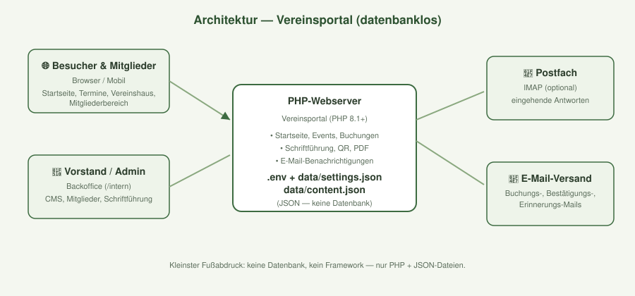
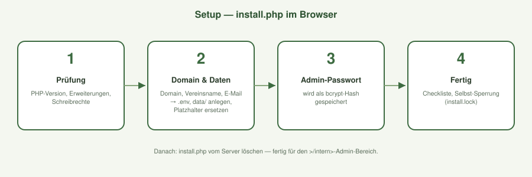

# Vereinsportal für Kleingartenvereine

Ein in Produktion bewährtes, datenbankloses Vereinsportal (PHP), das aus einer
echten Vereins-Website eines Hamburger Kleingartenvereins als wiederverwendbares
Open-Source-Template veröffentlicht wurde.

## Features

- **Öffentliche Vereinswebsite** — Startseite, Termine, Galerie, Vereinshaus, Kontakt
- **Event- & Buchungssystem** — Veranstaltungen anlegen, registrieren, stornieren;
  Vereinshaus-Buchung mit Preisoptionen und Sperrdaten
- **Mitgliederbereich** — Registrierung, Login, Profil, Nachrichten an den Vorstand
- **Backoffice (`/intern`)** — Inhalts-Editor (CMS), Mitglieder-Verwaltung,
  Schriftführung (Anträge, Schäden, Kassenbuch-Export), QR-Codes & PDF-Aushänge
  für Veranstaltungen, E-Mail-Benachrichtigungen
- **E-Mail-Anbindung** — IMAP-Empfang eingehender Antworten
- **Konfiguration ohne Datenbank** — alles in `data/settings.json` + `data/content.json`
  und `.env` für Secrets

## Architektur & Setup



Das Portal läuft ohne Datenbank — Konfiguration und Inhalte liegen in
`data/settings.json` und `data/content.json`, Secrets in `.env`.



Der Setup-Assistent (`install.php`) führt in vier Schritten durch die
Einrichtung: Prüfung → Domain/Daten → Admin-Passwort → Fertig.

## Voraussetzungen

- PHP **8.1+** (Ext.: `mbstring`, `gd`, `dom`, `json`) + Webserver (Apache mit
  `mod_rewrite` oder nginx)
- Optional: IMAP-Erweiterung für den E-Mail-Empfang
- **Keine Datenbank nötig** (JSON-basierte Datenablage)

## Schnellstart

```bash
# 1. Dateien auf den Webserver kopieren
# 2. .env aus .env.example anlegen und ausfüllen
cp .env.example .env
# 3. data/ anlegen, Beispielstruktur übernehmen und befüllen
mkdir data
cp data.example/settings.example.json data/settings.json
cp data.example/content.example.json data/content.json
# 4. in .htaccess, sitemap.xml, robots.txt, security.txt: YOUR-DOMAIN.TLD ersetzen
# 5. Cron-Jobs einrichten (siehe INSTALL.md)
```

> **Wichtig:** `data/` und `.env` enthalten echte Vereins-/Mitgliederdaten und
> sind in `.gitignore` ausgeschlossen — niemals veröffentlichen!

## Dokumentation

- [INSTALL.md](INSTALL.md) — vollständige Schritt-für-Schritt-Anleitung
- [README_SECURITY.md](README_SECURITY.md) — Hinweise zur Secret-Behandlung
- [data.example/](data.example/) — Beispieldaten für die Einrichtung

## Lizenz

MIT — siehe [LICENSE](LICENSE).

---

*Gepflegt von [Horizont Labor](https://www.horizontlabor.de) — Webentwicklung mit Liebe zum Verein.*
